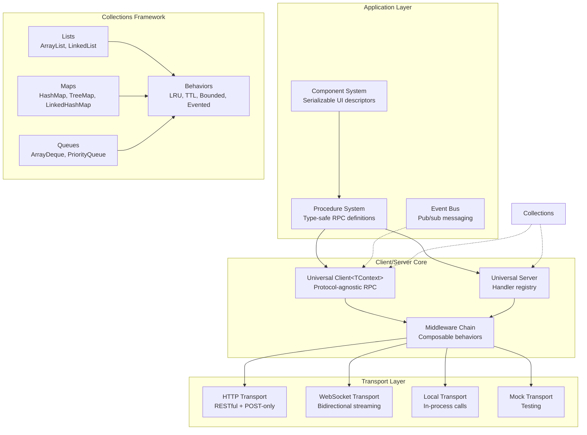
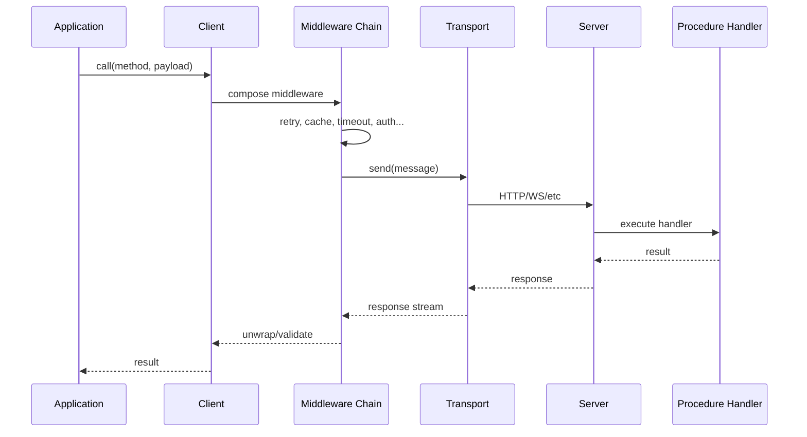

# @mark1russell7/client

[](https://www.npmjs.com/package/@mark1russell7/client)
[](https://opensource.org/licenses/MIT)
[](https://www.typescriptlang.org/)
[](https://nodejs.org/)

**Universal protocol-agnostic RPC client/server with middleware composition, type-safe procedures, components, and rich collections framework.**

## Table of Contents

- [Overview](#overview)
- [Installation](#installation)
- [Architecture](#architecture)
- [Core Concepts](#core-concepts)
- [API Reference](#api-reference)
- [Examples](#examples)
- [Integration](#integration)

## Overview

`@mark1russell7/client` is the foundational package of the Mark ecosystem, providing a complete RPC framework with:

- **Universal Client/Server**: Protocol-agnostic RPC supporting HTTP, WebSocket, gRPC, and local transports
- **Type-Safe Procedures**: Schema-validated procedures with auto-discovery and registry management
- **Middleware System**: Composable middleware for retry, cache, timeout, circuit breaker, rate limiting, auth, tracing, and validation
- **Collections Framework**: Java-inspired data structures (HashMap, TreeMap, PriorityQueue, etc.) with behaviors (LRU, TTL, bounded, synchronized)
- **Component System**: Serializable UI descriptors for SSR and wire transport
- **Event Bus**: Pub/sub messaging with async iteration support
- **Error System**: 70+ error codes with rich metadata and recovery suggestions


## Installation

```bash
npm install github:mark1russell7/client#main
```

**Peer Dependencies:**
- `zod` ^3.0.0 (optional, for validation)
- `express` ^4.0.0 || ^5.0.0 (optional, for HTTP server)

## Architecture



### Data Flow



## Core Concepts

### 1. Universal Client

The `Client` class provides protocol-agnostic RPC with type-safe middleware composition:

- Generic over accumulated context type `Client<TContext>`
- Middleware chain builds type information through `.use()`
- Context inheritance via `.withContext()`
- Supports streaming and single request/response

### 2. Procedure System

Type-safe RPC procedure definitions with:
- Schema validation (Zod)
- Auto-discovery via package.json
- Handler execution (local or remote)
- Procedure-as-data (procedure references)

### 3. Middleware Composition

Onion-model middleware with:
- Type accumulation (`Client<BaseContext & RetryContext & ...>`)
- Context propagation (parent → client → per-call)
- Built-in middleware for common patterns

### 4. Collections Framework

Java-inspired data structures with:
- Interface-based design (`List`, `Map`, `Set`, `Queue`)
- Composable behaviors (LRU, TTL, bounded, synchronized)
- Middleware-style composition

### 5. Component System

Serializable UI descriptors for:
- Server-side rendering
- Wire transport (JSON-compatible)
- Type-safe component factories

## Quick Start

### Client

```typescript
import { Client, HttpTransport } from "@mark1russell7/client";

const client = new Client({
  transport: new HttpTransport({ baseUrl: "https://api.example.com" })
})
  .use(createRetryMiddleware({ maxRetries: 3 }))
  .use(createAuthMiddleware({ token: "abc123" }));

// RPC call
const user = await client.call({ service: "users", operation: "get" }, { id: "123" });

// Streaming
for await (const event of client.stream({ service: "events", operation: "watch" }, {})) {
  console.log(event);
}
```

### Procedures

```typescript
import { defineProcedure, registerProcedures } from "client";
import { z } from "zod";

const getUserProcedure = defineProcedure({
  path: ["users", "get"],
  input: z.object({ id: z.string() }),
  output: z.object({ id: z.string(), name: z.string() }),
  handler: async ({ id }, ctx) => {
    return await db.users.findById(id);
  },
});

registerProcedures([getUserProcedure]);
```

### Components

```typescript
import { defineComponent, nullOutput, fragment } from "client";

const UserCard = defineComponent({
  type: "user-card",
  factory: async (ctx) => ({
    type: "user-card",
    props: { name: ctx.data.name, avatar: ctx.data.avatar },
    children: [],
  }),
});
```

## API Reference

### Client

#### `class Client<TContext = {}>`

Universal RPC client with type-safe middleware composition.

**Constructor:**
```typescript
new Client(options: ClientOptions | Transport)

interface ClientOptions {
  transport: Transport;
  defaultMetadata?: Metadata;
  throwOnError?: boolean;  // default: true
}
```

**Methods:**
```typescript
// Add middleware (returns new typed client)
use<TProvides>(middleware: ClientMiddleware): Client<TContext & TProvides>

// Create child client with additional context
withContext<TAdditional>(context: TAdditional): Client<TContext & TAdditional>

// Make RPC call (request/response)
call<TReq, TRes>(method: Method, payload: TReq, options?: CallOptions): Promise<TRes>

// Make streaming RPC call
stream<TReq, TRes>(method: Method, payload: TReq, options?: CallOptions): AsyncIterable<TRes>

// Execute procedure by path or reference
exec<TOutput>(refOrPath: ProcedureRef | ProcedurePath, input?: unknown): Promise<TOutput>

// Nested route API (batch calls with middleware overrides)
route<TRoute>(request: CallRequest<TRoute>): Promise<CallResponse<TRoute>>
routeStream<TRoute>(request: CallRequest<TRoute>): StreamingCallResponse<TRoute>

// Register validation schema (requires Zod middleware)
schema(method: Method, schemas: { input?: ZodSchema; output?: ZodSchema }): this

// Set custom procedure registry
useRegistry(registry: ProcedureRegistry): this

// Close transport
close(): Promise<void>
```

### Transports

#### `HttpTransport`
```typescript
new HttpTransport(options: HttpTransportOptions)

interface HttpTransportOptions {
  baseUrl: string;
  urlStrategy?: UrlStrategy;           // default: defaultUrlPattern
  httpMethodStrategy?: HttpMethodStrategy;  // default: restfulHttpMethodStrategy
  headers?: Record<string, string>;
  fetch?: typeof fetch;
}
```

#### `WebSocketTransport`
```typescript
new WebSocketTransport(options: WebSocketTransportOptions)

interface WebSocketTransportOptions {
  url: string;
  protocols?: string[];
  reconnect?: boolean;  // default: true
  reconnectDelay?: number;  // default: 1000ms
  heartbeatInterval?: number;  // default: 30000ms
}
```

#### `LocalTransport`
```typescript
new LocalTransport(options: LocalTransportOptions)

interface LocalTransportOptions {
  handlers: Map<string, Handler>;
}
```

#### `MockTransport`
```typescript
new MockTransport(options?: MockTransportOptions)

// Use builder for mocking
mockBuilder()
  .method({ service: "users", operation: "get" })
  .response({ id: "123", name: "Alice" })
  .times(3)
  .delay(100)
  .build()
```

### Middleware

#### Retry Middleware
```typescript
createRetryMiddleware(options?: RetryOptions)

interface RetryOptions {
  maxAttempts?: number;      // default: 3
  initialDelay?: number;     // default: 1000ms
  maxDelay?: number;         // default: 30000ms
  backoffFactor?: number;    // default: 2
  jitter?: boolean;          // default: true
  retryableErrors?: string[];
}
```

#### Cache Middleware
```typescript
createCacheMiddleware(options?: CacheOptions)

interface CacheOptions {
  maxSize?: number;          // default: 100
  ttl?: number;              // default: 60000ms
  keyFn?: (method: Method, payload: unknown) => string;
  storage?: Map<string, CacheEntry>;
}
```

#### Timeout Middleware
```typescript
createTimeoutMiddleware(options: TimeoutOptions)
createOverallTimeoutMiddleware(timeout: number)
createCombinedTimeoutMiddleware(options: { overall: number; perAttempt: number })

interface TimeoutOptions {
  overall?: number;          // milliseconds
  perAttempt?: number;       // milliseconds
}
```

#### Auth Middleware
```typescript
createAuthMiddleware(options: AuthOptions)
createBearerAuthMiddleware(token: string | (() => string))
createApiKeyAuthMiddleware(apiKey: string, headerName?: string)

interface AuthOptions {
  token?: string | (() => string | Promise<string>);
  apiKey?: string;
  headerName?: string;
  scheme?: "Bearer" | "Basic" | string;
}
```

#### Circuit Breaker Middleware
```typescript
createCircuitBreakerMiddleware(options?: CircuitBreakerOptions)

interface CircuitBreakerOptions {
  threshold?: number;        // default: 5 failures
  timeout?: number;          // default: 60000ms
  resetTimeout?: number;     // default: 30000ms
}
```

#### Rate Limit Middleware
```typescript
createRateLimitMiddleware(options?: RateLimitOptions)

interface RateLimitOptions {
  maxTokens?: number;        // default: 10
  refillRate?: number;       // tokens per second, default: 1
  refillInterval?: number;   // milliseconds, default: 1000
}
```

#### Batching Middleware
```typescript
createBatchingMiddleware(options?: BatchingOptions)

interface BatchingOptions {
  maxBatchSize?: number;     // default: 10
  maxWaitTime?: number;      // default: 10ms
}
```

#### Tracing Middleware
```typescript
createTracingMiddleware(options?: TracingOptions)

interface TracingOptions {
  generateTraceId?: () => string;
  generateSpanId?: () => string;
  onSpanStart?: (span: Span) => void;
  onSpanEnd?: (span: Span) => void;
}
```

#### Validation Middleware (Zod)
```typescript
createZodMiddleware(options?: ZodMiddlewareOptions)

interface ZodMiddlewareOptions {
  mode?: "input" | "output" | "both";  // default: "both"
  throwOnError?: boolean;              // default: true
}
```

### Procedures

#### Define Procedure
```typescript
defineProcedure<TInput, TOutput, TMeta>(def: ProcedureDefinition): Procedure

interface ProcedureDefinition<TInput, TOutput, TMeta> {
  path: ProcedurePath;           // e.g., ["users", "get"]
  input: ZodSchema<TInput>;
  output: ZodSchema<TOutput>;
  handler?: ProcedureHandler<TInput, TOutput, TMeta>;
  metadata?: TMeta;
}

// Fluent builder
createProcedure()
  .path(["users", "get"])
  .input(z.object({ id: z.string() }))
  .output(z.object({ id: z.string(), name: z.string() }))
  .meta({ description: "Get user by ID" })
  .handler(async (input, ctx) => {
    return await db.users.findById(input.id);
  })
  .build()
```

#### Procedure Registry
```typescript
PROCEDURE_REGISTRY.register(procedure: Procedure)
PROCEDURE_REGISTRY.get(path: ProcedurePath): Procedure | undefined
PROCEDURE_REGISTRY.has(path: ProcedurePath): boolean
PROCEDURE_REGISTRY.delete(path: ProcedurePath): boolean
PROCEDURE_REGISTRY.list(): Procedure[]
PROCEDURE_REGISTRY.on(event: RegistryEventType, listener: RegistryListener)
```

#### Procedure References (Procedure-as-Data)
```typescript
// Build procedure reference
proc(["users", "get"])
  .input({ id: "123" })
  .when("immediate")  // "immediate" | "never" | "parent"
  .name("getUser")
  .build()

// Execute reference
const result = await client.exec(procedureRef)

// Hydrate nested references
const hydrated = await hydrateInput(input, executor)
```

### Components

```typescript
defineComponent<TInput>(def: ComponentDefinition): RegisteredComponent

interface ComponentDefinition<TInput> {
  type: string;
  namespace?: string;
  input: ZodSchema<TInput>;
  factory: ComponentFactory<TInput> | StreamingComponentFactory<TInput>;
  metadata?: ComponentMetadata;
}

// Simple component
simpleComponent("button", (ctx) => ({
  type: "button",
  props: { label: ctx.data.label }
}))

// Streaming component
streamingComponent("feed", async function* (ctx) {
  for await (const item of ctx.data.items) {
    yield { type: "feed-item", props: { item } }
  }
})

// Register bundle
registerBundle({
  namespace: "ui",
  components: [buttonComponent, cardComponent]
})
```

### Collections

#### List
```typescript
const list = arrayList<T>()      // ArrayList
const list = linkedList<T>()     // LinkedList

// Methods
list.add(item)
list.get(index)
list.set(index, item)
list.remove(index)
list.size()
list.isEmpty()
list.clear()
list[Symbol.iterator]()
```

#### Map
```typescript
const map = hashMap<K, V>()           // HashMap
const map = linkedHashMap<K, V>()     // LinkedHashMap
const map = treeMap<K, V>(compareFn)  // TreeMap

// Methods
map.set(key, value)
map.get(key)
map.has(key)
map.delete(key)
map.size()
map.clear()
map.keys()
map.values()
map.entries()
```

#### Set
```typescript
const set = hashSet<T>()          // HashSet
const set = treeSet<T>(compareFn) // TreeSet

// Methods
set.add(item)
set.has(item)
set.delete(item)
set.size()
set.clear()
set[Symbol.iterator]()
```

#### Queue
```typescript
const queue = arrayDeque<T>()              // ArrayDeque
const queue = priorityQueue<T>(compareFn)  // PriorityQueue

// Methods
queue.enqueue(item)
queue.dequeue()
queue.peek()
queue.size()
queue.isEmpty()
```

#### Behaviors
```typescript
// LRU
const cache = lruMap({ capacity: 100 })(hashMap<K, V>())

// TTL
const temp = ttlMap({ ttl: 60000 })(hashMap<K, V>())

// Bounded
const limited = boundedList({ capacity: 50 })(arrayList<T>())

// Evented
const logged = eventedMap()(hashMap<K, V>())
logged.on("set", ({ key, value }) => console.log(key, value))

// Composed
const advancedCache = compose(
  lruMap({ capacity: 100 }),
  ttlMap({ ttl: 60000 }),
  eventedMap()
)(hashMap<K, V>())
```

### Event Bus

```typescript
const bus = createEventBus()

// Subscribe
bus.on("user:created", (user) => console.log(user))
bus.once("app:ready", () => console.log("Ready"))

// Publish
bus.emit("user:created", { id: "123", name: "Alice" })

// Async iteration
for await (const event of bus.stream("user:*")) {
  console.log(event)
}

// Unsubscribe
const unsubscribe = bus.on("event", handler)
unsubscribe()
```

### Server

```typescript
const server = new Server(options?: ServerOptions)

// Register handler
server.register(method: Method, handler: ServerHandler)

// Add middleware
server.use(middleware: ServerMiddleware)

// Start server
await server.start()

// Stop server
await server.stop()
```

#### HTTP Server Transport
```typescript
new HttpServerTransport(server: Server, options: HttpServerTransportOptions)

interface HttpServerTransportOptions {
  port: number;
  hostname?: string;
  urlStrategy?: HttpUrlStrategy;
  cors?: boolean | CorsOptions;
}
```

#### WebSocket Server Transport
```typescript
new WebSocketServerTransport(server: Server, options: WebSocketServerTransportOptions)

interface WebSocketServerTransportOptions {
  port: number;
  path?: string;
  auth?: WebSocketAuthHandler;
  onConnection?: WebSocketConnectionHandler;
}
```

#### Procedure Server
```typescript
const server = createProcedureServer(options?: ProcedureServerOptions)

interface ProcedureServerOptions {
  registry?: ProcedureRegistry;
  storage?: StorageConfig;
  transports?: ServerTransport[];
}
```

### Error System

```typescript
// Create error
createError(code: string, context?: ErrorContext): RichError

// From HTTP status
createErrorFromHTTPStatus(status: number, context?: ErrorContext): RichError

// From exception
createErrorFromException(error: unknown, context?: ErrorContext): RichError

// Format error
formatError(error: RichError): string

// Check if known error
isKnownError(code: string): boolean

// Get error metadata
getErrorMetadata(code: string): ErrorMetadata | undefined

// Error registry
ERROR_REGISTRY.get(code: string): ErrorMetadata
ERROR_REGISTRY.has(code: string): boolean
ERROR_REGISTRY.list(): string[]
```

## Subpath Exports

```typescript
import { Client, HttpTransport, ... } from "@mark1russell7/client";
import { defineProcedure, PROCEDURE_REGISTRY, ... } from "@mark1russell7/client";
import { EventBus, createEventBus, ... } from "@mark1russell7/client";
import { HashMap, ArrayList, ... } from "@mark1russell7/client";

// OR use subpath exports
import { Client } from "@mark1russell7/client/client";
import { ... } from "@mark1russell7/client/procedures";
import { ... } from "@mark1russell7/client/events";
import { ... } from "@mark1russell7/client/components";
```

## Procedure Auto-Discovery

Packages can declare procedures in `package.json`:

```json
{
  "client": {
    "procedures": "./dist/register.js"
  },
  "scripts": {
    "postinstall": "client announce"
  }
}
```

When installed, procedures auto-register. Run `client discover` to generate the registry.

## Type-Safe Middleware

Middleware context types accumulate through the chain:

```typescript
const client = new Client(transport)
  .use(createRetryMiddleware())     // Client<RetryContext>
  .use(createCacheMiddleware())     // Client<RetryContext & CacheContext>
  .use(createAuthMiddleware());     // Client<... & AuthContext>
```

### Available Middleware

| Middleware | Purpose |
|------------|---------|
| `createRetryMiddleware` | Exponential backoff with jitter |
| `createCacheMiddleware` | LRU + TTL caching |
| `createTimeoutMiddleware` | Request timeout |
| `createAuthMiddleware` | Bearer token / API key |
| `createTracingMiddleware` | W3C Trace Context |
| `createCircuitBreakerMiddleware` | Fault tolerance |
| `createRateLimitMiddleware` | Token bucket throttling |
| `createBatchingMiddleware` | Request aggregation |

## EventBus

```typescript
import { createEventBus } from "client";

const bus = createEventBus();

// Subscribe
bus.on("user:created", (user) => console.log(user));

// Publish
bus.emit("user:created", { id: "123", name: "Alice" });

// Async iteration
for await (const event of bus.stream("user:*")) {
  console.log(event);
}
```

## Components

Serializable UI descriptors for server-side rendering:

```typescript
interface ComponentOutput {
  type: string;                    // Component type
  props: Record<string, unknown>;  // Props
  children?: ComponentOutput[];    // Nested children
  key?: string | number;           // React key
}

// Special outputs
nullOutput();                      // { type: "__null__" }
fragment([child1, child2]);        // { type: "__fragment__", children: [...] }
```

## Collections

Java-inspired data structures with composable behaviors:

```typescript
import { arrayList, hashMap, compose, lruMap, ttlMap, eventedList } from "client";

// Basic
const list = arrayList<number>();
const map = hashMap<string, User>();

// Composed with behaviors
const cache = compose(
  lruMap({ capacity: 100 }),
  ttlMap({ ttl: 60000 })
)(hashMap<string, Data>());

// Evented
const log = eventedList<Event>()(arrayList<Event>());
log.on("add", ({ item }) => console.log(item));
```

### Collection Types

| Type | Implementations |
|------|-----------------|
| List | `ArrayList`, `LinkedList` |
| Map | `HashMap`, `LinkedHashMap`, `TreeMap` |
| Set | `HashSet`, `TreeSet` |
| Queue | `ArrayDeque`, `PriorityQueue` |

### Behaviors

| Behavior | Description |
|----------|-------------|
| `bounded` | Capacity limits |
| `lru` | Least Recently Used eviction |
| `ttl` | Time-to-live expiration |
| `evented` | Event emission |
| `safe` | Option/Result error handling |
| `synchronized` | Thread safety |

## Server

```typescript
import { Server, HttpServerTransport } from "client";

const server = new Server({
  transports: [new HttpServerTransport({ port: 3000 })],
});

server.register(
  { service: "users", operation: "get" },
  async (request) => ({
    id: request.id,
    status: { type: "success", code: 200 },
    payload: await db.users.findById(request.payload.id),
    metadata: {},
  })
);

await server.start();
```

## Error System

70+ error codes with metadata:

```typescript
import { createError, ERROR_REGISTRY, ErrorCategory, ErrorSeverity } from "client";

const error = createError("E_TIMEOUT", {
  service: "users",
  operation: "get",
});
// { code: "E_TIMEOUT", message: "...", severity: "error", category: "timeout", ... }
```

## Examples

### Advanced Middleware Composition
```typescript
const client = new Client({ transport: new HttpTransport({ baseUrl: "/api" }) })
  .use(createTimeoutMiddleware({ overall: 10000, perAttempt: 5000 }))
  .use(createRetryMiddleware({ maxAttempts: 3, initialDelay: 1000 }))
  .use(createCacheMiddleware({ maxSize: 100, ttl: 60000 }))
  .use(createCircuitBreakerMiddleware({ threshold: 5, timeout: 60000 }))
  .use(createRateLimitMiddleware({ maxTokens: 10, refillRate: 1 }))
  .use(createTracingMiddleware())
  .use(createZodMiddleware());

// Context inheritance
const authedClient = client.withContext({ auth: { token: "user-token" } });
const adminClient = authedClient.withContext({ auth: { token: "admin-token" } });
```

### Procedure-as-Data (Declarative Composition)
```typescript
// Define procedures
const addProcedure = defineProcedure({
  path: ["git", "add"],
  input: z.object({ all: z.boolean() }),
  output: z.object({ success: z.boolean() }),
  handler: async ({ all }) => {
    // ... git add logic
    return { success: true };
  },
});

// Compose via procedure references
const deployPipeline = proc(["chain"]).input({
  steps: [
    proc(["git", "add"]).input({ all: true }).ref,
    proc(["git", "commit"]).input({ message: "deploy" }).ref,
    proc(["git", "push"]).ref,
  ],
}).build();

// Execute
const result = await client.exec(deployPipeline);
```

### Nested Route API (Batch Execution)
```typescript
const result = await client.route({
  batch: { strategy: "all", maxConcurrency: 5 },
  middlewares: {
    retry: { attempts: 3 },
    timeout: { overall: 10000 },
  },
  route: {
    users: {
      get: { id: "123" },          // users.get({ id: "123" })
      list: { limit: 10 },         // users.list({ limit: 10 })
    },
    orders: {
      list: { userId: "123" },     // orders.list({ userId: "123" })
    },
  },
});

// Access results
console.log(result.users.get.data);   // { id: "123", name: "Alice" }
console.log(result.users.list.data);  // [{ id: "1", ... }, ...]
console.log(result.orders.list.data); // [{ id: "ord_1", ... }, ...]
```

### Collections with Behaviors
```typescript
// Build an LRU cache with TTL and eventing
const cache = compose(
  lruMap({ capacity: 100 }),
  ttlMap({ ttl: 60000 }),
  eventedMap()
)(hashMap<string, Data>());

cache.on("evict", ({ key, value }) => {
  console.log(`Evicted: ${key}`);
});

cache.set("key1", data);
const value = cache.get("key1");
```

### Streaming Components
```typescript
const feedComponent = streamingComponent("feed", async function* (ctx) {
  const items = await fetchFeedItems(ctx.data.userId);

  for await (const item of items) {
    yield {
      type: "feed-item",
      props: {
        id: item.id,
        content: item.content,
        timestamp: item.createdAt,
      },
    };
  }
});
```

### WebSocket Bidirectional RPC
```typescript
// Client
const client = new Client({
  transport: new WebSocketTransport({ url: "ws://localhost:3000" })
});

for await (const event of client.stream({ service: "events", operation: "watch" }, {})) {
  console.log("Received:", event);
}

// Server
const server = new Server();
const wsTransport = new WebSocketServerTransport(server, {
  port: 3000,
  onConnection: (connectionId) => {
    console.log("Client connected:", connectionId);
  },
});

server.register({ service: "events", operation: "watch" }, async function* (request) {
  // Stream events to client
  while (true) {
    const event = await eventSource.next();
    yield {
      id: request.id,
      status: { type: "success", code: 200 },
      payload: event,
      metadata: {},
    };
  }
});

await server.start();
```

## Integration with Ecosystem

### Connection Management
Use with `@mark1russell7/client-connection` for bidirectional RPC:
```typescript
import "@mark1russell7/client-connection/register";

// List connected clients
const { connections } = await client.call(["connection", "list"], {});

// Call procedure on specific client
const result = await client.call(["connection", "call"], {
  clientId: "abc123",
  path: ["render"],
  input: { template: "home" },
});
```

### Shell Execution
Use with `@mark1russell7/client-shell`:
```typescript
import "@mark1russell7/client-shell/register";

const result = await client.call(["shell", "run"], {
  command: "git",
  args: ["status"],
  cwd: "/path/to/repo",
});
console.log(result.stdout);
```

### Procedure Scaffolding
Use with `@mark1russell7/client-procedure`:
```typescript
import "@mark1russell7/client-procedure/register";

const result = await client.call(["procedure", "new"], {
  name: "user.create",
  description: "Create a new user",
});
```

## Requirements

- **Node.js**: >= 20
- **TypeScript**: >= 5.0
- **Dependencies**: `ws` ^8.18.3
- **Peer Dependencies** (optional):
  - `zod` ^3.0.0 (for validation)
  - `express` ^4.0.0 || ^5.0.0 (for HTTP server)

## License

MIT

## Contributing

This package is part of the Mark ecosystem. See the main repository for contribution guidelines.

## See Also

- `@mark1russell7/client-connection` - Connection management for bidirectional RPC
- `@mark1russell7/client-shell` - Shell command execution procedures
- `@mark1russell7/client-procedure` - Procedure scaffolding utilities
- `@mark1russell7/bundle-dev` - Development bundle with all client packages
