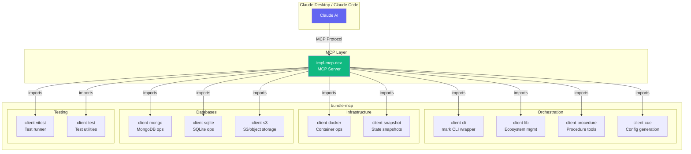

# @mark1russell7/bundle-mcp

[](https://www.npmjs.com/package/@mark1russell7/bundle-mcp)
[](https://opensource.org/licenses/MIT)
[](https://www.typescriptlang.org/)
[](https://nodejs.org/)

> Curated MCP bundle - high-level orchestration tools for Claude integration via Model Context Protocol.

## Overview

`@mark1russell7/bundle-mcp` provides a **curated collection of procedures** optimized for AI assistant integration via MCP. Unlike `bundle-dev` which includes all tools, this bundle focuses on **high-level orchestration** tools since Claude already has shell access for low-level operations.

**Key Design Decisions:**
- **Excludes** low-level tools (`fs.*`, `git.*`, `shell.*`, `pnpm.*`) - Claude can use these via shell
- **Includes** high-level orchestration (`lib.*`, `cli.*`, `procedure.*`)
- **Includes** infrastructure management (`docker.*`, `snapshot.*`)
- **Includes** database operations (`mongo.*`, `sqlite.*`, `s3.*`)
- **Includes** testing utilities (`vitest.*`, `test.*`)

## Table of Contents

- [Architecture](#architecture)
- [Installation](#installation)
- [Included Packages](#included-packages)
- [Usage with MCP](#usage-with-mcp)
- [Configuration](#configuration)
- [Comparison with bundle-dev](#comparison-with-bundle-dev)

## Architecture



### Bundle Composition

```
bundle-mcp
├── Core Orchestration
│   ├── @mark1russell7/client-cli      → cli.run (mark CLI wrapper)
│   ├── @mark1russell7/client-lib      → lib.* (scan, install, new, refresh)
│   ├── @mark1russell7/client-procedure → procedure.* (new, list, delete)
│   └── @mark1russell7/client-cue      → cue.* (init, add, generate)
│
├── Infrastructure
│   ├── @mark1russell7/client-docker   → docker.* (run, build, compose)
│   └── @mark1russell7/client-snapshot → snapshot.* (create, restore)
│
├── Databases
│   ├── @mark1russell7/client-mongo    → mongo.* (query, aggregate, indexes)
│   ├── @mark1russell7/client-sqlite   → db.* (query, execute)
│   └── @mark1russell7/client-s3       → s3.* (upload, download, list)
│
└── Testing
    ├── @mark1russell7/client-vitest   → vitest.* (run, watch)
    └── @mark1russell7/client-test     → test.* (run, coverage)
```

## Installation

```bash
npm install github:mark1russell7/bundle-mcp#main
```

## Included Packages

| Package | Procedures | Description |
|---------|------------|-------------|
| **client-cli** | `cli.run` | Execute `mark` CLI commands |
| **client-lib** | `lib.scan`, `lib.install`, `lib.new`, `lib.refresh`, `lib.audit`, `lib.pull` | Ecosystem package management |
| **client-procedure** | `procedure.new`, `procedure.list`, `procedure.delete` | Procedure scaffolding |
| **client-cue** | `cue.init`, `cue.add`, `cue.remove`, `cue.generate`, `cue.validate` | Config file generation |
| **client-docker** | `docker.run`, `docker.build`, `docker.pull`, `docker.exec`, `docker.stop`, `docker.rm`, `docker.ps`, `docker.logs`, `docker.compose.up`, `docker.compose.down` | Docker container management |
| **client-snapshot** | `snapshot.create`, `snapshot.restore`, `snapshot.list` | State snapshots |
| **client-mongo** | `mongo.database.ping`, `mongo.database.info`, `mongo.collections.*`, `mongo.documents.*`, `mongo.indexes.*` | MongoDB operations |
| **client-sqlite** | `db.query`, `db.execute` | SQLite operations |
| **client-s3** | `s3.upload`, `s3.download`, `s3.list`, `s3.delete` | S3/object storage |
| **client-vitest** | `vitest.run`, `vitest.watch` | Vitest test runner |
| **client-test** | `test.run`, `test.coverage` | Test utilities |

## Usage with MCP

### With impl-mcp-dev

```bash
# Set bundle-mcp as the default bundle
MCP_BUNDLES=@mark1russell7/bundle-mcp node /path/to/impl-mcp-dev/dist/server.js
```

### Claude Desktop Configuration

Add to `claude_desktop_config.json`:

**Windows:** `%APPDATA%\Claude\claude_desktop_config.json`
**macOS:** `~/Library/Application Support/Claude/claude_desktop_config.json`

```json
{
  "mcpServers": {
    "dev-tools": {
      "command": "node",
      "args": ["/path/to/impl-mcp-dev/dist/server.js"],
      "env": {
        "MCP_BUNDLES": "@mark1russell7/bundle-mcp"
      }
    }
  }
}
```

### Claude Code Configuration

Add to `~/.claude.json`:

```json
{
  "projects": {
    "/path/to/your/project": {
      "mcpServers": {
        "dev-tools": {
          "type": "stdio",
          "command": "node",
          "args": ["/path/to/impl-mcp-dev/dist/server.js"],
          "env": {
            "MCP_BUNDLES": "@mark1russell7/bundle-mcp",
            "MONGODB_URI": "mongodb://localhost:27017"
          }
        }
      }
    }
  }
}
```

## Configuration

### Environment Variables

| Variable | Default | Description |
|----------|---------|-------------|
| `MCP_BUNDLES` | `@mark1russell7/bundle-mcp` | Bundle to load (comma-separated for multiple) |
| `MCP_DEBUG` | `false` | Enable debug logging |
| `MONGODB_URI` | - | MongoDB connection string (for mongo.* procedures) |
| `AWS_ACCESS_KEY_ID` | - | AWS credentials (for s3.* procedures) |
| `AWS_SECRET_ACCESS_KEY` | - | AWS credentials (for s3.* procedures) |

## Comparison with bundle-dev

| Feature | bundle-mcp | bundle-dev |
|---------|------------|------------|
| **Purpose** | MCP/AI integration | Development CLI |
| **Low-level fs/git/shell** | Not included | Included |
| **High-level orchestration** | Included | Included |
| **Docker operations** | Included | Included |
| **Database operations** | Included | Included |
| **Testing utilities** | Included | Included |
| **Tool count** | ~50 procedures | ~100+ procedures |

### Why Exclude Low-Level Tools?

When using Claude via MCP, Claude already has access to shell commands. Including `fs.*`, `git.*`, `shell.*`, and `pnpm.*` procedures would be redundant since:

1. Claude can run `git status` directly via shell
2. Claude can run `cat file.txt` directly via shell
3. Claude can run `pnpm install` directly via shell

The procedures in bundle-mcp provide **higher-level abstractions** that are more valuable:

- `lib.install` - Clone and build entire ecosystem (not just pnpm install)
- `docker.compose.up` - Orchestrate multi-container environments
- `mongo.documents.aggregate` - Type-safe MongoDB aggregation pipelines
- `vitest.run` - Structured test output with coverage

## Programmatic Usage

```typescript
// Import registers all procedures
import "@mark1russell7/bundle-mcp/register.js";

// Or import the package (also registers)
import "@mark1russell7/bundle-mcp";

// Now all procedures are available
import { PROCEDURE_REGISTRY } from "@mark1russell7/client";

const procedures = PROCEDURE_REGISTRY.list();
console.log(`Loaded ${procedures.length} procedures`);
```

## Dependencies

This bundle imports and re-exports:

```typescript
// Core orchestration
import "@mark1russell7/client-cli";
import "@mark1russell7/client-lib";
import "@mark1russell7/client-procedure";
import "@mark1russell7/client-cue";

// Infrastructure
import "@mark1russell7/client-docker";
import "@mark1russell7/client-snapshot";

// Databases
import "@mark1russell7/client-mongo";
import "@mark1russell7/client-sqlite";
import "@mark1russell7/client-s3";

// Testing
import "@mark1russell7/client-vitest";
import "@mark1russell7/client-test";
```

## Requirements

- **Node.js**: >= 20
- **TypeScript**: >= 5.9
- **Docker**: Required for docker.* procedures
- **MongoDB**: Required for mongo.* procedures (or use docker-mongo)

## Related Packages

- `@mark1russell7/impl-mcp-dev` - MCP server entry point
- `@mark1russell7/client-mcp` - MCP transport implementation
- `@mark1russell7/mcp` - MCP types and utilities
- `@mark1russell7/bundle-dev` - Full development bundle (includes low-level tools)

## License

MIT
