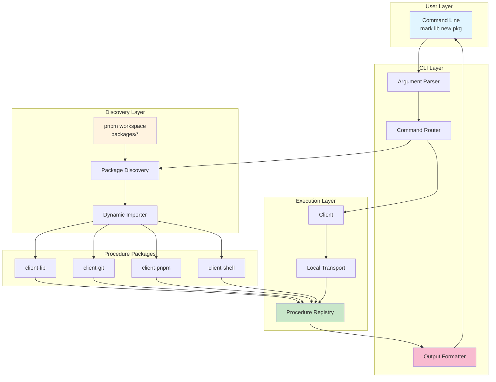
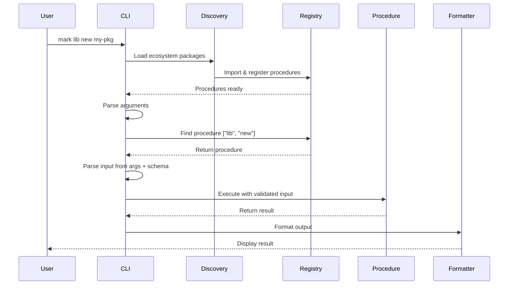
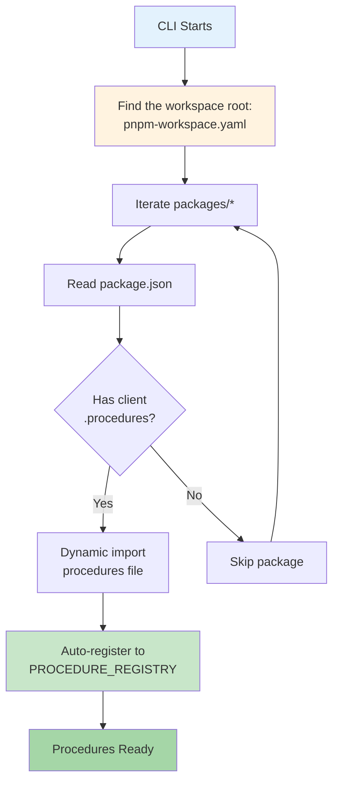
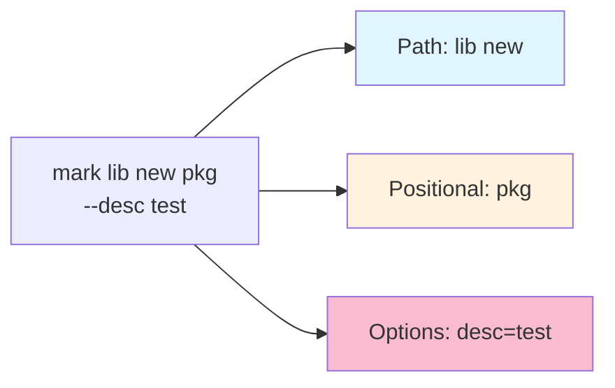
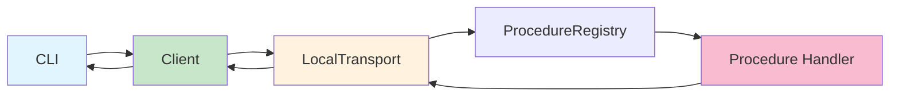

# @mark1russell7/cli

[](https://opensource.org/licenses/MIT)

> Mark CLI - Development workflow automation through dynamic procedure discovery

## Overview

`@mark1russell7/cli` is a dynamic, extensible CLI that automatically discovers and executes procedures from ecosystem packages. It provides a unified interface for development workflows, package management, and automation tasks across the `@mark1russell7` ecosystem.

### Key Features

- **Dynamic Procedure Discovery**: Automatically loads procedures from ecosystem packages
- **Self-Documenting**: Generates help text from procedure schemas
- **Type-Safe**: Leverages Zod schemas for runtime validation
- **Multiple Output Formats**: text, json, table, streaming with spinners
- **Workspace-Aware**: Loads each package of its pnpm workspace that declares `client.procedures`
- **Extensible**: New commands added by installing procedure packages

## Architecture



## Installation

`mark` is the package `packages/mark` of the `client` monorepo. Build the workspace, then run the CLI:

```bash
pnpm install && pnpm build
node packages/mark/dist/cli.js --help
```

### Prerequisites

- Node.js >= 25.0.0
- pnpm (the version of the workspace `packageManager` field)

## Execution Flow



## API Reference

### CLI Binary

The package provides a `mark` binary for command-line usage.

#### Basic Syntax

```bash
mark [global options] <path...> [positional...] [--options]
mark --server [--port N] [--host H] [--transport http|websocket|both]
mark -i
```

The bin is `dist/bin.js`. `node dist/cli.js` also runs the CLI. Importing `@mark1russell7/cli` runs nothing.

#### Global Options

A flag before the command path is a global flag. After the path, a flag is the command's flag when the command declares it. Otherwise it is a global flag. For example, `mark docker compose down -v` gives `-v` (volumes) to the command. To show the version, write `mark -v`. `mark lib audit` lists the command flags that hide a global flag.

| Option | Short | Description |
|--------|-------|-------------|
| `--help` | `-h` | Show help for command or group |
| `--version` | `-v` | Show CLI version |
| `--verbose` | `-V` | Enable verbose output during discovery |
| `--format <format>` | `-f` | Override output format (text, json, table, streaming) |
| `--local` | | Run the command in this process, not on the CLI server |
| `--json <json>` | | Execute raw procedure reference |
| `--server` | | Start the CLI server (with `--port`, `--host`, `--transport`) |
| `--interactive` | `-i` | Start the REPL |

#### Exit Codes and Failures

`mark` exits with code 1 when:

- the command is unknown, or the command line has a problem (an unknown flag, a missing value, an extra argument);
- the input is not valid for the procedure;
- the procedure throws an error;
- the result reports a failure.

A procedure reports a failure in one of three ways:

1. It throws an error. This is the usual way.
2. It returns an object with `success: false`. Use this when the result has more to show, for example the problems that `lib audit` found.
3. It returns an object with an `exitCode` that is not 0. Use this for a procedure that runs an external command, for example `vitest run`.

For a streaming procedure, `mark` examines each item. One failed item makes the command fail.

#### Examples

```bash
# Show all available commands
mark

# Show help for a command group
mark lib --help

# Show help for specific command
mark lib new --help

# Execute command with options
mark lib new my-package --preset lib

# Override output format
mark git status --format json

# A global flag before the command (docker ps has its own --format)
mark --format json docker ps

# Verbose discovery
mark --verbose lib new my-pkg
```

### Programmatic API

#### `run(argv: string[]): Promise<void>`

Main CLI entry point.

```typescript
import { run } from "@mark1russell7/cli";

// Execute CLI programmatically
await run(["lib", "new", "my-package"]);
```

#### `parseFromSchema(params, meta, schema?): Record<string, unknown>`

Parse CLI arguments based on procedure metadata. With the schema, each value is converted by the type of its field. `parseCommandLine(argv, procedures)` splits a whole command line: the global flags, the path and the input.

```typescript
import { parseFromSchema } from "@mark1russell7/cli";

const params = {
  array: ["my-package"],
  options: { description: "My pkg" }
};

const meta = {
  args: ["name"],
  shorts: { description: "d" }
};

const input = parseFromSchema(params, meta);
// { name: "my-package", description: "My pkg" }
```

#### `generateHelp(path, meta, schema?): string`

Generate help text for a procedure.

```typescript
import { generateHelp } from "@mark1russell7/cli";

const help = generateHelp(
  ["lib", "new"],
  {
    description: "Create a new library package",
    args: ["name"],
    shorts: { skipGit: "g" }
  },
  schema
);

console.log(help);
```

#### `formatOutput(print, result, format): void`

Format and print procedure results.

```typescript
import { formatOutput } from "@mark1russell7/cli";

// print: an object with info, error, success, warning, table and spin (see format.ts)
formatOutput(print, { message: "Success!" }, "text");
formatOutput(print, { rows: [...] }, "table");
formatOutput(print, { data: {...} }, "json");
```

### CLI Metadata Interface

Procedures define CLI behavior via metadata:

```typescript
interface CLIMeta {
  /** Description for help text */
  description?: string;

  /** Field names that are positional args (in order) */
  args?: string[];

  /** Short flag mappings: { fieldName: "f" } */
  shorts?: Record<string, string>;

  /** Output format hint */
  output?: "text" | "json" | "table" | "streaming";

  /** Whether to prompt for missing required fields */
  interactive?: boolean;
}
```

### Output Format Types

```typescript
type OutputFormat = "text" | "json" | "table" | "streaming";
```

## Ecosystem Discovery

The CLI uses a multi-step discovery process to find and load procedures:

### Discovery Flow



### Package Structure

For a package to be discovered, it must:

1. Be a folder in `packages/` of the workspace that holds this CLI
2. Have a `client.procedures` field in package.json
3. Export procedure registrations from that file

A package that does not load gives one warning line. A package that is not built yet is reported only with `--verbose`.

**Example package.json:**
```json
{
  "name": "@mark1russell7/client-lib",
  "client": {
    "procedures": "./dist/register.js"
  }
}
```

**Example register.js:**
```typescript
import { defineProcedure } from "@mark1russell7/client";
import { z } from "zod";

const libNew = defineProcedure({
  path: ["lib", "new"],
  input: z.object({
    name: z.string(),
  }),
  handler: async (input, ctx) => {
    // Implementation
    return { message: "Created!" };
  },
  metadata: {
    description: "Create a new library",
    args: ["name"],
  },
});

// Auto-registers when imported
```

### Discovery Sources

| Source | Path | Description |
|--------|------|-------------|
| Workspace | `<root>/pnpm-workspace.yaml`, `<root>/packages/*` | The packages that `mark` examines |
| Package Metadata | `<pkg>/package.json` | Contains `client.procedures` path |
| Procedure Registry | `PROCEDURE_REGISTRY` | Global registry from `@mark1russell7/client` |

## Argument Parsing

The CLI uses a smart parser that detects procedure paths and maps arguments correctly.

### Path Detection



### Parsing Rules

1. **Path Segments**: Consumed until a procedure match is found.
2. **Flags**: A flag is a field of the input schema (`--skip-git` or `--skipGit`), or the short letter of the metadata (`-m`). A flag that the procedure does not declare is a global flag. Otherwise it is an error.
3. **Types**: Each value is converted by the type of its field. A string field keeps its text: `mark fs exists 2024` gives the path `"2024"`, not a number. A number field needs a number. An object field, or a field with no type, takes JSON.
4. **Boolean Flags**: A boolean flag alone is `true`. It also takes `true` or `false` after it, `--flag=false`, or `--no-flag`.
5. **Arrays and Records**: A repeated array flag collects its values (`--tag a --tag b`). A record flag takes `key=value` and can be repeated (`--env A=1 --env B=2`). Both also take JSON.
6. **Positional Args**: The fields of `args` take the arguments in order. A last array field takes the rest. An argument that no field takes is an error.
7. **Values**: A negative number is a value (`--count -5`). `--` ends the flags: the tokens after it are arguments. Short boolean flags can be grouped (`-it`). A short flag can have its value attached (`-n5`).

### Examples

```bash
# Simple command
mark lib new my-package
# path: ["lib", "new"]
# input: { name: "my-package" }

# With options
mark lib new my-package --preset lib --dry-run
# input: { name: "my-package", preset: "lib", dryRun: true }

# A boolean flag with a value
mark git commit --message "message" --amend false
# input: { message: "message", amend: false }

# Short flags (the metadata of git push maps -f to force and -u to setUpstream)
mark git push -fu
# input: { force: true, setUpstream: true }

# Arguments that look like flags, after --
mark docker exec box -- ls -la /tmp
# input: { container: "box", command: ["ls", "-la", "/tmp"] }
```

### Metadata-Based Mapping

```typescript
// Procedure metadata
metadata: {
  args: ["name", "version"],     // Positional mapping
  shorts: { skipGit: "g" },      // Short flag mapping
}

// Command
// mark lib new my-pkg 1.0.0 -g

// Parsed input
{
  name: "my-pkg",
  version: "1.0.0",
  skipGit: true
}
```

## Output Formatting

The CLI supports multiple output formats for different use cases.

### Text Format

Default format for human-readable output.

```typescript
// Result with message
{ message: "Package created successfully!" }
// Output: Package created successfully!

// Result with output field
{ output: "file contents..." }
// Output: file contents...

// Result with error
{ success: false, message: "Failed to create" }
// Output: [ERROR] Failed to create
```

### JSON Format

Structured output for programmatic consumption.

```bash
mark lib scan --format json
```

```json
{
  "rootPath": "/path/to/client",
  "packages": { "@mark1russell7/client-lib": { "name": "@mark1russell7/client-lib" } }
}
```

### Table Format

Tabular data display.

```bash
mark procedure list --format table
```

```
path              description
fs read           Read file contents
fs write          Write content to file
```

### Streaming Format

Shows a spinner during execution, then displays the result.

```bash
mark lib audit --format streaming
# Running lib audit...
# lib audit complete
# Result displayed
```

## Integration with the Workspace

`mark` loads each package of its pnpm workspace that has a `client.procedures` field in its `package.json`. The field names the built module that registers the procedures.

### Procedure Packages

Each client package can export procedures:

```
packages/client-lib/
├── src/
│   ├── procedures/lib/new.ts
│   ├── procedures/lib/audit.ts
│   └── register.ts         # Registers all procedures
├── dist/
│   └── register.js         # Built procedures
└── package.json
    └── client.procedures: "./dist/register.js"
```

### Transport Layer



## Available Commands

Commands are discovered dynamically. Common procedure packages include:

### client-lib

Package management and scaffolding:
- `mark lib new <name>` - Create new package
- `mark lib scan` - List the workspace packages
- `mark lib audit` - Check the packages against the template

### client-git

Git operations:
- `mark git status` - Show git status
- `mark git commit` - Create commit
- `mark git push` - Push to remote

### client-pnpm

Package manager operations:
- `mark pnpm install` - Install dependencies
- `mark pnpm add <pkg>` - Add package
- `mark pnpm remove <pkg>` - Remove package

### client-shell

Shell command execution:
- `mark shell run <command>` - Run shell command
- `mark shell exec <command>` - Execute command
- `mark shell which <binary>` - Find binary in PATH

### client-procedure

Procedure management:
- `mark procedure new <path>` - Create new procedure
- `mark procedure list` - List all procedures

## Advanced Usage

### Procedure References

Execute procedures via JSON for advanced scripting:

```bash
# Execute procedure reference
mark --json '{
  "$proc": ["lib", "new"],
  "input": {
    "name": "my-package",
    "dryRun": true
  }
}'
```

### Chaining Commands

Use standard shell pipes. A failed command exits with code 1, so `&&` stops at it:

```bash
# Get package list and filter
mark --format json lib scan | jq '.packages | keys'

# Create a package, then audit the workspace
mark lib new my-pkg && mark lib audit
```

### Environment Variables

```bash
# The home folder holds the lockfiles of the CLI servers (~/.mark)
export HOME=/custom/path
```

## Development

### Building

```bash
pnpm --filter @mark1russell7/cli build
```

### Testing

```bash
pnpm --filter @mark1russell7/cli test       # unit tests (src/**/*.test.ts)
pnpm --filter @mark1russell7/cli test:e2e   # end-to-end tests: they run dist/bin.js as a process
```

The end-to-end tests use a temporary home folder and a temporary workspace. They do not change the repository and do not use a running CLI server.

There is no container image of `mark`: the CLI server serves the workspace of the folder where it starts, on loopback, with a token in the lockfile of the user. A container cannot give that. To serve procedures over the network, use the `server` package.

### Project Structure

```
packages/mark/
├── src/
│   ├── bin.ts           # The mark executable
│   ├── cli.ts           # Main CLI implementation (also runnable as dist/cli.js)
│   ├── args.ts          # Command line splitting: global flags, path, procedure flags
│   ├── parse.ts         # Field types, value conversion and help text
│   ├── failure.ts       # Procedure-level failure and the exit code
│   ├── format.ts        # Output formatters
│   ├── ecosystem.ts     # Discovery system
│   └── index.ts         # Public API (importing it runs nothing)
├── e2e/                 # End-to-end tests
├── test/                # Test procedures for the unit tests
└── package.json
    └── bin: { "mark": "./dist/bin.js" }
```

### Key Modules

#### cli.ts

Main CLI implementation:
- Command routing
- Procedure execution
- Help generation
- Error handling

#### parse.ts

Argument parsing and schema introspection:
- `parseFromSchema()` - Parse args based on metadata
- `generateHelp()` - Generate help text
- `extractSchemaFields()` - Introspect Zod schemas

#### format.ts

Output formatting:
- `formatOutput()` - Format results based on type
- `formatText()` - Plain text output
- `formatTable()` - Tabular output

#### ecosystem.ts

Procedure discovery:
- `discoverFromEcosystem()` - Find procedure packages
- `loadEcosystemProcedures()` - Load and register procedures
- `listEcosystemProcedurePackages()` - List available packages

## Troubleshooting

### Procedure Not Found

```
Unknown command: mark foo bar
```

**Solution:**
1. Check that the package is in `packages/` of the workspace
2. Verify the package has `client.procedures` in package.json
3. Ensure the package is built (`pnpm build` in the workspace root)
4. Use `mark --verbose` to see which packages are being loaded

### Import Error

```
mark: the procedures of @mark1russell7/client-foo did not load: <message>
```

**Solution:**
1. Check that the procedures file exists at the specified path
2. Verify the file is valid JavaScript (not TypeScript)
3. Build the workspace: `pnpm build`

### Help Not Showing Schema Fields

```
# Only shows basic help without field details
```

**Solution:** Ensure procedures have Zod schemas defined in the `input` field. The CLI introspects schemas to generate detailed help.

## Dependencies

The CLI depends on:

- `@mark1russell7/client` - Client library and procedure system
- `@mark1russell7/client-*` - Various procedure packages
- `chalk`, `ora`, `cli-table3` - Terminal output
- `zod` - Schema validation

## License

MIT

## Repository

https://github.com/mark1russell7/cli

## Author

Mark Russell <marktheprogrammer17@gmail.com>
