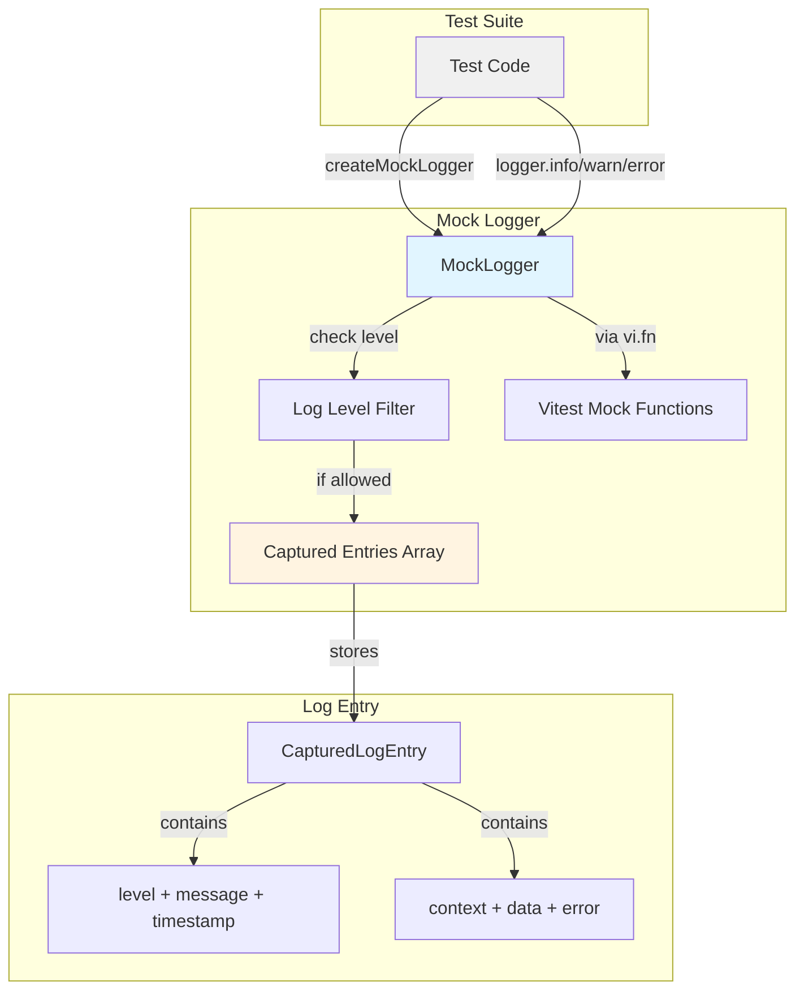
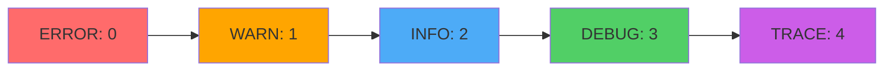
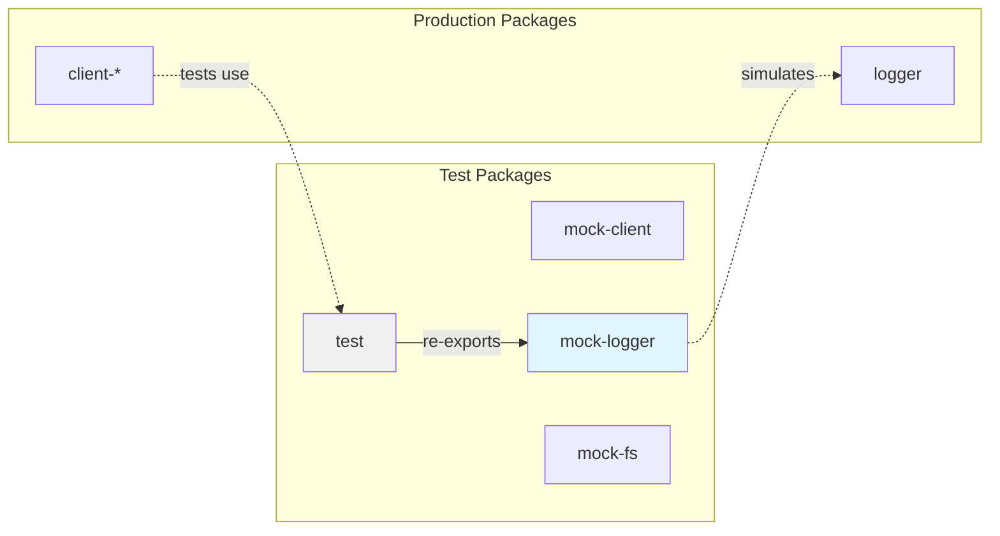

# @mark1russell7/mock-logger

[](https://www.npmjs.com/package/@mark1russell7/mock-logger)
[](https://www.typescriptlang.org/)
[](https://vitest.dev/)

Mock Logger implementation for unit testing. Provides a fully-featured logging interface that captures all log entries, supports level filtering, hierarchical contexts, and enables comprehensive verification of logging behavior.

## Overview

`@mark1russell7/mock-logger` simulates logging behavior for testing. It enables developers to:

- **Capture all log output** with messages, levels, contexts, and metadata
- **Filter by log level** (ERROR, WARN, INFO, DEBUG, TRACE)
- **Create child loggers** with hierarchical contexts
- **Verify logging** using pattern matching (string or regex)
- **Inspect entries** with rich metadata including timestamps and additional data
- **Track mock calls** using Vitest-compatible mock functions

## Installation

```bash
npm install github:mark1russell7/mock-logger#main
```

## Architecture



### Log Level Hierarchy



When log level is set to a value (e.g., `WARN`), only messages at that level or higher severity are captured.

## Quick Start

```typescript
import { describe, it, expect, beforeEach } from "vitest";
import { createMockLogger, LogLevel, type MockLogger } from "@mark1russell7/mock-logger";

describe("logging behavior", () => {
  let logger: MockLogger;

  beforeEach(() => {
    logger = createMockLogger();
  });

  it("should capture log messages", () => {
    logger.info("Processing started");
    logger.warn("Low memory");
    logger.error("Critical failure");

    expect(logger.hasLogged("Processing started")).toBe(true);
    expect(logger.hasLoggedAtLevel(LogLevel.ERROR, "Critical")).toBe(true);
  });

  it("should filter by level", () => {
    logger.setLevel(LogLevel.WARN);

    logger.debug("Debug message");  // Not captured
    logger.warn("Warning message"); // Captured

    const entries = logger.getEntries();
    expect(entries).toHaveLength(1);
    expect(entries[0].message).toBe("Warning message");
  });
});
```

## API Reference

### Types

#### `LogLevel`
```typescript
enum LogLevel {
  ERROR = 0,  // Highest severity
  WARN = 1,
  INFO = 2,
  DEBUG = 3,
  TRACE = 4,  // Lowest severity
}

const LOG_LEVEL_NAMES: Record<LogLevel, string> = {
  [LogLevel.ERROR]: "ERROR",
  [LogLevel.WARN]: "WARN",
  [LogLevel.INFO]: "INFO",
  [LogLevel.DEBUG]: "DEBUG",
  [LogLevel.TRACE]: "TRACE",
};
```

#### `CapturedLogEntry`
```typescript
interface CapturedLogEntry {
  level: LogLevel;                        // Log level
  message: string;                        // Log message
  context?: string | undefined;           // Logger context (e.g., "App:Service")
  timestamp: Date;                        // When the log was captured
  data?: Record<string, unknown> | undefined;  // Additional structured data
  error?: Error | undefined;              // Associated error object
}
```

#### `LogOptions`
```typescript
interface LogOptions {
  context?: string | undefined;              // Override/add context for this log
  data?: Record<string, unknown> | undefined;     // Structured metadata
  error?: Error | undefined;                 // Error to attach
}
```

#### `MockFn<TArgs, TReturn>`
```typescript
interface MockFn<TArgs extends unknown[] = unknown[], TReturn = void> {
  (...args: TArgs): TReturn;
  mockClear(): void;
  mock: { calls: TArgs[] };
}
```

#### `MockLogger`
```typescript
interface MockLogger {
  // Log methods (all are Vitest mock functions)
  log: MockFn<[LogLevel, string, LogOptions?], void>;
  error: MockFn<[string, LogOptions?], void>;
  warn: MockFn<[string, LogOptions?], void>;
  info: MockFn<[string, LogOptions?], void>;
  debug: MockFn<[string, LogOptions?], void>;
  trace: MockFn<[string, LogOptions?], void>;

  // Child logger creation
  child(context: string): MockLogger;

  // Level management
  setLevel(level: LogLevel): void;
  getLevel(): LogLevel;

  // Entry inspection
  getEntries(): CapturedLogEntry[];
  getEntriesForLevel(level: LogLevel): CapturedLogEntry[];

  // Assertions
  hasLogged(message: string | RegExp): boolean;
  hasLoggedAtLevel(level: LogLevel, message: string | RegExp): boolean;

  // Cleanup
  clear(): void;   // Clear entries only
  reset(): void;   // Clear entries and reset mock call counts
}
```

#### `CreateMockLoggerOptions`
```typescript
interface CreateMockLoggerOptions {
  level?: LogLevel | undefined;      // Initial log level (default: TRACE - captures all)
  context?: string | undefined;      // Default context prefix
}
```

### Factory Functions

#### `createMockLogger(options?)`
Creates a new mock logger instance.

```typescript
function createMockLogger(options?: CreateMockLoggerOptions): MockLogger
```

**Parameters:**
- `options.level` - Initial log level filter (default: `LogLevel.TRACE` - captures everything)
- `options.context` - Default context prefix for all log entries

**Returns:** `MockLogger` instance

**Example:**
```typescript
import { createMockLogger, LogLevel } from "@mark1russell7/mock-logger";

// Capture everything
const logger = createMockLogger();

// Only capture WARN and ERROR
const prodLogger = createMockLogger({ level: LogLevel.WARN });

// With default context
const appLogger = createMockLogger({ context: "MyApp" });
```

### Logging Methods

```typescript
// Simple messages
logger.info("User logged in");
logger.warn("Rate limit approaching");
logger.error("Database connection failed");

// With context
logger.info("Request received", { context: "HttpServer" });

// With data
logger.info("User created", { data: { userId: "123", email: "user@example.com" } });

// With error
logger.error("Operation failed", { error: new Error("Timeout") });
```

### Child Loggers

Create loggers with inherited context:

```typescript
const logger = createMockLogger({ context: "App" });
const childLogger = logger.child("Database");

childLogger.info("Connected");
// Entry: { context: "App:Database", message: "Connected" }
```

### Inspecting Entries

```typescript
// Get all entries
const entries = logger.getEntries();

// Get by level
const errors = logger.getEntriesForLevel(LogLevel.ERROR);

// Check if logged
if (logger.hasLogged("Connection established")) {
  console.log("Connection was logged");
}

// Check with regex
if (logger.hasLogged(/user.*created/i)) {
  console.log("User creation was logged");
}

// Check at specific level
if (logger.hasLoggedAtLevel(LogLevel.ERROR, "timeout")) {
  console.log("Timeout error was logged");
}
```

### Level Filtering

```typescript
const logger = createMockLogger({ level: LogLevel.WARN });

logger.debug("Debug message");  // Ignored (below WARN)
logger.warn("Warning message"); // Captured
logger.error("Error message");  // Captured

expect(logger.getEntries()).toHaveLength(2);
```

## Testing Patterns

### Verify Error Logging

```typescript
it("should log errors on failure", async () => {
  const logger = createMockLogger();

  await processData(logger, { invalidData: true });

  expect(logger.hasLoggedAtLevel(LogLevel.ERROR, "validation")).toBe(true);
  const errors = logger.getEntriesForLevel(LogLevel.ERROR);
  expect(errors[0].data?.field).toBe("email");
});
```

### Verify No Errors

```typescript
it("should complete without errors", async () => {
  const logger = createMockLogger();

  await processData(logger, { validData: true });

  const errors = logger.getEntriesForLevel(LogLevel.ERROR);
  expect(errors).toHaveLength(0);
});
```

### Verify Specific Messages

```typescript
it("should log progress", async () => {
  const logger = createMockLogger();

  await processItems(logger, ["a", "b", "c"]);

  expect(logger.hasLogged(/Processing item: a/)).toBe(true);
  expect(logger.hasLogged(/Processing item: b/)).toBe(true);
  expect(logger.hasLogged(/Processing item: c/)).toBe(true);
});
```

## Integration with Ecosystem

### Dependencies

This package is standalone with only Vitest as a peer dependency:

```json
{
  "peerDependencies": {
    "vitest": "^3.0.0"
  }
}
```

### Used By

- `@mark1russell7/test` - Re-exports mock-logger for consolidated testing utilities
- All ecosystem packages - Use for verifying logging behavior in tests

### Testing Architecture



## Best Practices

### 1. Verify Critical Errors

```typescript
it("should log errors on failure", async () => {
  const logger = createMockLogger();

  await processWithErrors(logger);

  const errors = logger.getEntriesForLevel(LogLevel.ERROR);
  expect(errors.length).toBeGreaterThan(0);
  expect(errors[0].message).toContain("validation failed");
});
```

### 2. Assert No Unexpected Errors

```typescript
it("should complete without errors", async () => {
  const logger = createMockLogger();

  await processSuccessfully(logger);

  const errors = logger.getEntriesForLevel(LogLevel.ERROR);
  expect(errors).toHaveLength(0);
});
```

### 3. Use Child Loggers for Context

```typescript
const logger = createMockLogger({ context: "App" });
const dbLogger = logger.child("Database");
const apiLogger = logger.child("API");

dbLogger.info("Connected");  // Context: "App:Database"
apiLogger.info("Request");   // Context: "App:API"
```

### 4. Verify Structured Logging

```typescript
it("should log structured data", async () => {
  const logger = createMockLogger();

  await processUser(logger, { id: "123", email: "user@example.com" });

  const entries = logger.getEntries();
  expect(entries[0].data).toMatchObject({
    userId: "123",
    action: "created"
  });
});
```

### 5. Test Level Filtering

```typescript
it("should respect log level", () => {
  const logger = createMockLogger({ level: LogLevel.WARN });

  logger.debug("Debug message");  // Not captured
  logger.info("Info message");    // Not captured
  logger.warn("Warning message"); // Captured
  logger.error("Error message");  // Captured

  expect(logger.getEntries()).toHaveLength(2);
});
```

## Troubleshooting

### Logs not being captured

Check the log level setting:

```typescript
// Wrong - level too high
const logger = createMockLogger({ level: LogLevel.ERROR });
logger.info("Info message"); // Not captured

// Correct - level allows INFO
const logger = createMockLogger({ level: LogLevel.INFO });
logger.info("Info message"); // Captured
```

### Pattern matching not working

Ensure the pattern is correct:

```typescript
// Wrong - exact match required for strings
logger.info("User logged in");
logger.hasLogged("logged in"); // true (substring match)
logger.hasLogged("User logged in"); // true (exact substring)

// Use regex for more control
logger.hasLogged(/user.*logged.*in/i); // true (case-insensitive)
```

### Context not appearing

Make sure to set context when creating logger or in log options:

```typescript
const logger = createMockLogger({ context: "App" });
logger.info("Message");

const entry = logger.getEntries()[0];
expect(entry.context).toBe("App");
```

## License

MIT

## Contributing

See the main repository for contribution guidelines.

## Related Packages

- `@mark1russell7/test` - Unified test utilities (includes this package)
- `@mark1russell7/mock-client` - Mock client for testing procedures
- `@mark1russell7/mock-fs` - Mock file system for testing
- `@mark1russell7/logger` - Real logger implementation
