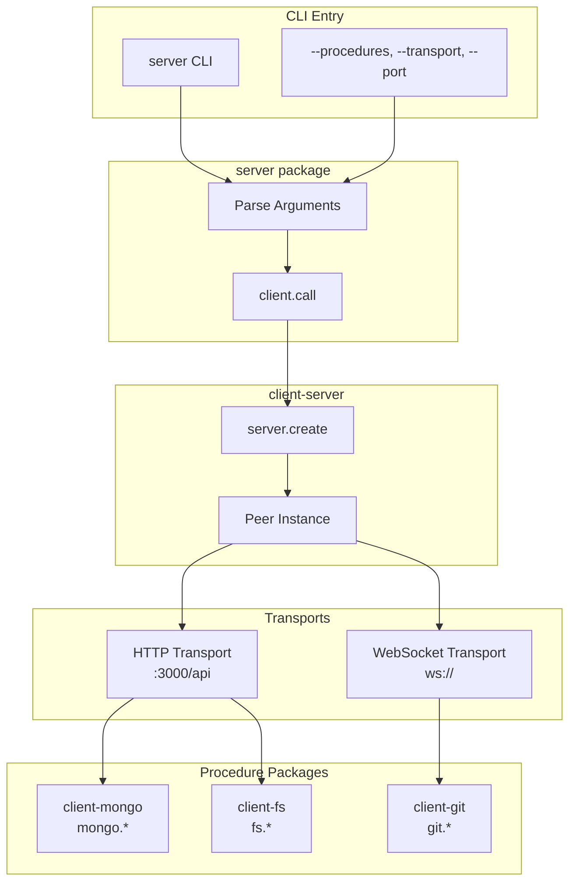
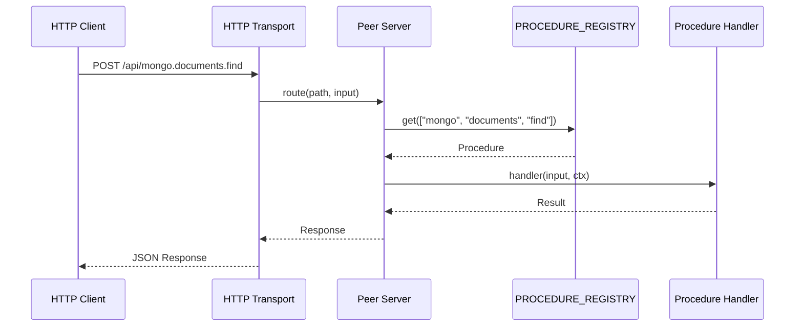
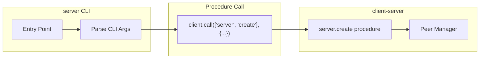
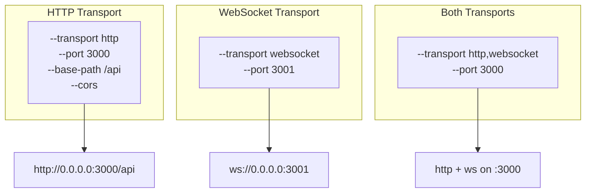
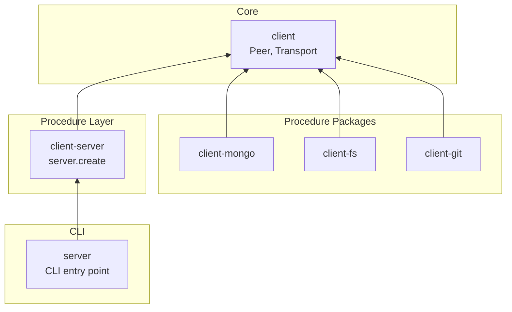

# @mark1russell7/server

[](https://opensource.org/licenses/MIT)
[](https://www.typescriptlang.org/)
[](https://nodejs.org/)

> General procedure server - run any procedure packages via HTTP or WebSocket transports.

## Table of Contents

- [Overview](#overview)
- [Installation](#installation)
- [Architecture](#architecture)
- [Quick Start](#quick-start)
- [CLI Reference](#cli-reference)
- [Examples](#examples)
- [Integration](#integration)
- [Requirements](#requirements)
- [License](#license)

---

## Overview

**server** is a CLI tool that runs procedure packages as HTTP/WebSocket servers:

- **Universal** - Run any combination of procedure packages
- **Multi-Transport** - HTTP, WebSocket, or both simultaneously
- **Dogfooding** - Uses `server.create` procedure internally
- **Zero Config** - Sensible defaults, fully configurable

---

## Installation

```bash
npm install -g @mark1russell7/server
```

---

## Architecture

### System Overview



### Request Flow



### Dogfooding Pattern



---

## Quick Start

```bash
# Start MongoDB procedure server
server --procedures @mark1russell7/client-mongo/register --port 3000

# Start with multiple procedure packages
server -p @mark1russell7/client-fs/register,@mark1russell7/client-git/register

# Start with multiple transports
server -p @mark1russell7/client-mongo/register -t http,websocket
```

---

## CLI Reference

### Options

| Option | Alias | Default | Description |
|--------|-------|---------|-------------|
| `--procedures` | `-p` | - | Comma-separated procedure packages to load |
| `--transport` | `-t` | `http` | Transports: http, websocket, local |
| `--port` | - | `3000` | Port for the primary transport |
| `--host` | - | `0.0.0.0` | Host to bind to |
| `--base-path` | - | `/api` | Base path for HTTP transport |
| `--cors` | - | `true` | Enable CORS |
| `--no-cors` | - | - | Disable CORS |
| `--verbose` | `-v` | - | Verbose output |
| `--help` | `-h` | - | Show help |

### Transport Configuration



---

## Examples

### MongoDB Server

```bash
server --procedures @mark1russell7/client-mongo/register --port 3000
```

**Output:**
```
Starting procedure server...
  Loading: @mark1russell7/client-mongo/register

Server started!
  Server ID: server-1703694523456
  Procedures: 16

Endpoints:
  [http] http://0.0.0.0:3000/api

Press Ctrl+C to stop the server.
```

### Multi-Package Server

```bash
server -p @mark1russell7/client-fs/register,@mark1russell7/client-git/register \
       -t http,websocket \
       --port 3000
```

### Calling Procedures

```bash
# HTTP call
curl -X POST http://localhost:3000/api/mongo.documents.find \
  -H "Content-Type: application/json" \
  -d '{"collection": "users", "filter": {"active": true}}'

# Response
{"documents": [{"_id": "...", "name": "Alice"}], "count": 1}
```

---

## Integration

### Replacing Domain-Specific Servers

The `server` package replaces domain-specific server packages:

```bash
# OLD (deprecated)
npx @mark1russell7/server-mongo

# NEW (general)
npx server --procedures @mark1russell7/client-mongo/register
```

### With client-server

The server CLI uses `server.create` procedure internally:

```typescript
// What the CLI does internally:
await client.call(["server", "create"], {
  transports: [{ type: "http", port: 3000, cors: true }],
  autoRegister: true,
});
```

### Package Hierarchy



---

## Requirements

- **Node.js** >= 20
- **Dependencies:**
  - `@mark1russell7/client`
  - `@mark1russell7/client-server`
  - One or more procedure packages

---

## License

MIT
